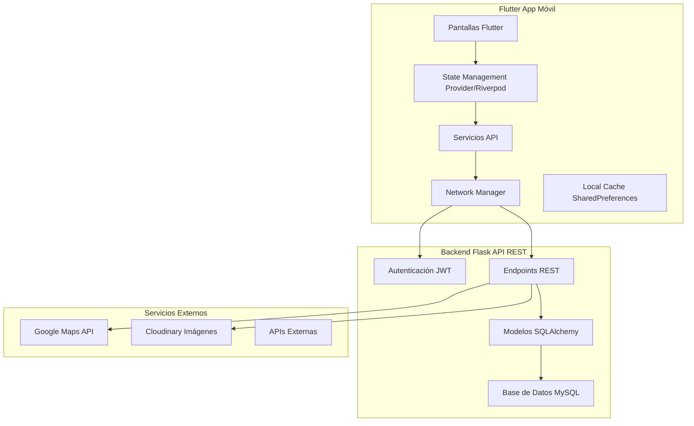
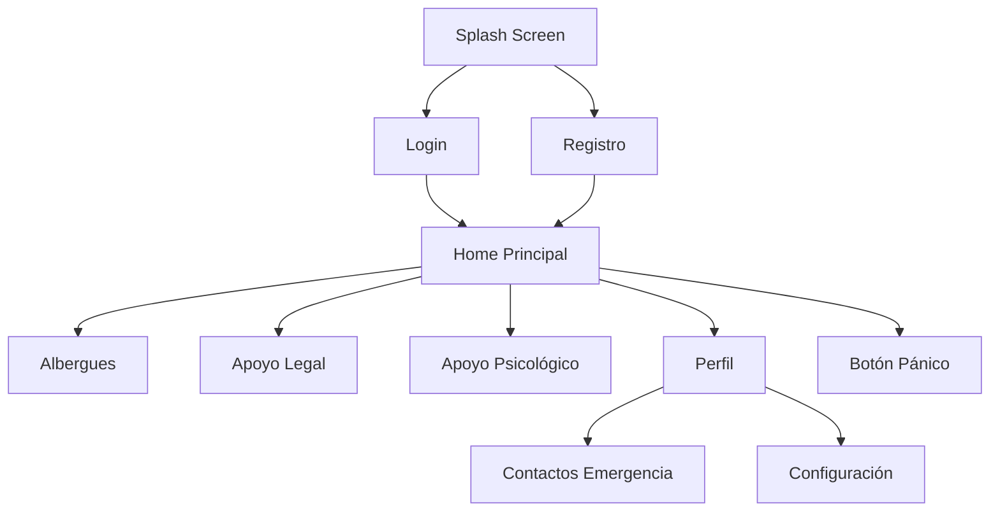

# Plan de Migración: HTML/Flask → Flutter Móvil

## 📋 Resumen del Proyecto

**Objetivo:** Migrar la aplicación web Luz Violeta (Flask/HTML) a una aplicación móvil nativa Android/iOS usando Flutter, manteniendo Flask como API REST.

---

## 🏗️ Arquitectura Propuesta



---

## 📱 Estructura del Proyecto Flutter

```
luz_violeta_app/
├── lib/
│   ├── main.dart                    # Entry point
│   ├── app.dart                     # App configuration
│   ├── config/
│   │   ├── themes/
│   │   │   ├── app_theme.dart
│   │   │   ├── colors.dart
│   │   │   └── typography.dart
│   │   └── constants.dart
│   ├── core/
│   │   ├── error/
│   │   │   ├── exceptions.dart
│   │   │   └── failures.dart
│   │   ├── network/
│   │   │   ├── network_info.dart
│   │   │   └── dio_client.dart
│   │   └── usecases/
│   │       └── usecase.dart
│   ├── features/
│   │   ├── auth/                   # Autenticación
│   │   │   ├── data/
│   │   │   │   ├── models/
│   │   │   │   └── repositories/
│   │   │   ├── domain/
│   │   │   │   ├── entities/
│   │   │   │   ├── repositories/
│   │   │   │   └── usecases/
│   │   │   └── presentation/
│   │   │       ├── screens/
│   │   │       ├── widgets/
│   │   │       └── bloc/
│   │   ├── home/                    # Pantalla Principal
│   │   ├── albergues/               # Albergues y Mapas
│   │   ├── legal/                   # Apoyo Legal
│   │   ├── psychological/           # Apoyo Psicológico
│   │   ├── profile/                 # Perfil Usuario
│   │   ├── panic_button/            # Botón Pánico
│   │   └── admin/                   # Panel Admin
│   ├── shared/
│   │   ├── widgets/
│   │   ├── utils/
│   │   └── extensions/
│   └── di/                         # Dependency Injection
├── assets/
│   ├── images/
│   └── icons/
├── pubspec.yaml
└── test/
```

---

## 🔌 Endpoints API REST Necesarios

### Autenticación
| Método | Endpoint | Descripción |
|--------|----------|-------------|
| POST | `/api/auth/login` | Iniciar sesión |
| POST | `/api/auth/register` | Registrar usuario |
| POST | `/api/auth/logout` | Cerrar sesión |
| GET | `/api/auth/me` | Datos usuario actual |
| POST | `/api/auth/refresh` | Refrescar token |

### Albergues
| Método | Endpoint | Descripción |
|--------|----------|-------------|
| GET | `/api/albergues` | Lista albergues |
| GET | `/api/albergues/<id>` | Detalle albergue |
| GET | `/api/albergues/alcaldia/<id>` | Por alcaldía |
| GET | `/api/albergues/mapa` | Datos para mapa |

### Abogados (Apoyo Legal)
| Método | Endpoint | Descripción |
|--------|----------|-------------|
| GET | `/api/abogados` | Lista abogados |
| GET | `/api/abogados/<id>` | Detalle abogado |
| GET | `/api/abogados/alcaldia/<id>` | Por alcaldía |

### Psicólogos
| Método | Endpoint | Descripción |
|--------|----------|-------------|
| GET | `/api/psicologos` | Lista psicólogos |

### Usuarios
| Método | Endpoint | Descripción |
|--------|----------|-------------|
| GET | `/api/usuario/perfil` | Obtener perfil |
| PUT | `/api/usuario/perfil` | Actualizar perfil |
| PUT | `/api/usuario/password` | Cambiar contraseña |
| POST | `/api/usuario/foto` | Subir foto |

### Contactos Emergencia
| Método | Endpoint | Descripción |
|--------|----------|-------------|
| GET | `/api/emergencia/contactos` | Lista contactos |
| POST | `/api/emergencia/contactos` | Crear contacto |
| PUT | `/api/emergencia/contactos/<id>` | Editar contacto |
| DELETE | `/api/emergencia/contactos/<id>` | Eliminar contacto |

### Botón Pánico
| Método | Endpoint | Descripción |
|--------|----------|-------------|
| POST | `/api/panico/activar` | Activar alerta |
| GET | `/api/panico/historial` | Historial alertas |

---

## 🎨 Pantallas de la App

### Flujo de Usuario



### Descripción de Pantallas

| Pantalla | Widgets Principales | Funcionalidad |
|----------|---------------------|----------------|
| **Splash** | Logo animado | Carga inicial |
| **Login** | TextFields email/pass, botón login, enlace registro | Autenticación |
| **Registro** | Campos formulario, selector rol | Nuevo usuario |
| **Home** | NavigationBar, Cards servicios, Info emergencia | Navegación principal |
| **Albergues** | Google Maps, Lista cards, Filtro alcaldías | Ver refugios |
| **Mapa Detalle** | Marker selección, InfoWindow | Detalle refugio |
| **Apoyo Legal** | Lista abogados, Cards con contacto | Contactar abogados |
| **Apoyo Psicológico** | Chat interface, Quick actions | Chat de apoyo |
| **Perfil** | Avatar, Datos personales, Configuración | Gestión perfil |
| **Contactos** | Lista contactos, FAB agregar, Cards | CRUD contactos |
| **Botón Pánico** | Botón grande animado, Feedback visual | Alerta emergencia |
| **Admin Dashboard** | Stats cards, Navegación admin | Panel administración |
| **Admin Usuarios** | DataTable, Filtros, Acciones | Gestión usuarios |
| **Admin Albergues** | Lista editable, Formulario, Mapa | CRUD albergues |

---

## 🛠️ Dependencias Flutter

```yaml
# pubspec.yaml
dependencies:
  flutter:
    sdk: flutter
  
  # Networking
  dio: ^5.3.0          # HTTP client
  http: ^1.1.0         # Alternative HTTP
  connectivity_plus: ^5.0.0  # Network status
  
  # State Management
  provider: ^6.0.5      # State management
  riverpod: ^2.3.6      # Alternative state management
  get: ^4.6.5          # Alternative state + navigation
  
  # Auth
  shared_preferences: ^2.2.0  # Local storage
  flutter_secure_storage: ^9.0.0  # Secure storage JWT
  
  # UI
  google_fonts: ^5.1.0  # Fuentes
  flutter_svg: ^2.0.7   # SVG icons
  cached_network_image: ^3.2.3  # Image cache
  
  # Maps
  google_maps_flutter: ^2.5.0  # Google Maps
  location: ^5.0.0        # GPS location
  
  # Chat
  flutter_chat_ui: ^1.6.8  # Chat interface
  
  # Utils
  url_launcher: ^6.1.11  # Open URLs, calls
  phone_numbers_strings: ^1.1.0  # Phone formatting
  intl: ^0.18.1         # Date formatting
  image_picker: ^1.0.2   # Image selection
  
  # Design System
  flutter_screenutil: ^5.8.4  # Responsive design
  gap: ^3.0.1            # Spacing widget
  
  # Analytics
  firebase_core: ^2.15.0  # Firebase (optional)
  firebase_crashlytics: ^3.3.0  # Crash reporting
```

---

## 📅 Fases de Implementación

### Fase 1: Setup y Configuración (Semana 1)
- [ ] Crear proyecto Flutter
- [ ] Configurar estructura Clean Architecture
- [ ] Configurar Dio client para API
- [ ] Implementar manejo de tokens JWT
- [ ] Configurar navegación
- [ ] Setup theme y colores

### Fase 2: Autenticación (Semana 2)
- [ ] Pantalla Login
- [ ] Pantalla Registro
- [ ] Pantalla Recuperar Contraseña
- [ ] Servicio Auth Repository
- [ ] SharedPreferences para sesión
- [ ] Flujo completo auth

### Fase 3: Pantalla Home y Navegación (Semana 3)
- [ ] Bottom Navigation Bar
- [ ] Cards de servicios
- [ ] Integración servicios API
- [ ] Estados de carga y error
- [ ] Pull to refresh

### Fase 4: Albergues y Mapas (Semana 4-5)
- [ ] Integración Google Maps
- [ ] API de ubicación
- [ ] Lista de albergues
- [ ] Filtro por alcaldías
- [ ] Detalle albergue
- [ ] Llamadas directas

### Fase 5: Apoyo Legal y Psicológico (Semana 6)
- [ ] Lista abogados
- [ ] Contacto directo
- [ ] Chat de apoyo psicológico
- [ ] Quick actions

### Fase 6: Perfil y Contactos (Semana 7)
- [ ] Pantalla perfil
- [ ] Edición de datos
- [ ] Foto de perfil
- [ ] CRUD contactos emergencia
- [ ] Cambio de contraseña

### Fase 7: Botón Pánico (Semana 8)
- [ ] Diseño botón grande
- [ ] Confirmación de emergencia
- [ ] Envío de ubicación
- [ ] Notificaciones
- [ ] Historial

### Fase 8: Panel Admin (Semana 9-10)
- [ ] Dashboard stats
- [ ] Gestión usuarios
- [ ] CRUD albergues
- [ ] Reportes

### Fase 9: Testing y Optimización (Semana 11)
- [ ] Unit tests
- [ ] Widget tests
- [ ] Performance optimization
- [ ] Accessibility checks
- [ ] Beta testing

### Fase 10: Deployment (Semana 12)
- [ ] Build Android APK
- [ ] Build iOS IPA
- [ ] Play Store submission
- [ ] App Store submission
- [ ] Documentación

---

## 🔧 Cambios Necesarios en Backend

### 1. Crear API REST Blueprint

```python
# app/api_rest.py
from flask import Blueprint, jsonify, request
from flask_jwt_extended import jwt_required, get_jwt_identity

api_bp = Blueprint('api_bp', __name__, url_prefix='/api')

# Los endpoints deben retornar JSON en lugar de render_template
@api_bp.route('/albergues', methods=['GET'])
def get_albergues():
    albergues = Albergue.query.all()
    return jsonify([a.to_dict() for a in albergues])
```

### 2. Instalar JWT

```bash
pip install flask-jwt-extended
```

### 3. Configurar CORS

```python
from flask_cors import CORS

CORS(app, resources={r"/api/*": {"origins": "*"}})
```

---

## 📊 Resumen de Cambios

| Área | Actual | Futuro |
|------|--------|--------|
| Frontend | HTML/CSS/JS + Tailwind | Flutter + Provider |
| Backend | Flask + Jinja templates | Flask API REST + JWT |
| Estado | Sessions server-side | Provider + SharedPreferences |
| Base datos | MySQL | MySQL (sin cambios) |
| Mapas | Google Maps iframe | Google Maps Flutter |
| Chat | Web | Flutter Chat UI |
| Imágenes | Cloudinary | Cloudinary API |

---

## ✅ Checklist de Preparación

- [ ] Instalar Flutter SDK
- [ ] Crear cuenta Firebase (opcional)
- [ ] Configurar Google Cloud Console para Maps API
- [ ] Obtener API Keys necesarias
- [ ] Configurar CORS en Flask
- [ ] Crear endpoints API REST
- [ ] Implementar JWT en Flask
- [ ] Documentar API con Swagger

---

## 🎯 Próximos Pasos Inmediatos

1. **Confirmar este plan** para proceder con la implementación
2. **Crear estructura base** del proyecto Flutter
3. **Configurar API client** básico
4. **Empezar con Fase 1** (Setup y Auth)

¿Tienes alguna pregunta sobre este plan o necesitas que ajuste alguna parte antes de empezar?
